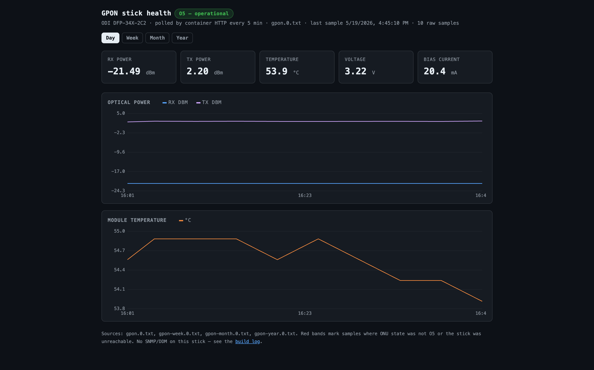

# GPON Telemetry Dashboard for RouterOS Containers

Small telemetry stack for Realtek/RTL960x-style GPON ONU sticks whose stock
Boa web UI exposes optical and ONU state data at `/status_pon.asp`.

It is intentionally not a metrics stack. RouterOS keeps the raw 24h log using
its own disk logger and rotation. A tiny container does the HTTP scrape,
static dashboard serving, and longer rollups.

Background and hardware context:
[Replacing a Converge ONT with a GPON SFP stick](https://marfillaster.github.io/converge-gpon-sfp-stick-mikrotik/).

## Dashboard



## Quick Start

On an arm64 RouterOS device with Containers enabled, use the published image:

```text
docker.io/marfillaster/gpon-telemetry:alpine-arm64
```

1. Copy [routeros/install.remote-image.rsc](routeros/install.remote-image.rsc)
   to the router.
2. Edit these placeholders in the script:

```routeros
:local remoteImage "docker.io/marfillaster/gpon-telemetry:alpine-arm64"
:local storageRoot "<storage-volume>"
:local containerIPv4 "<container-ipv4-cidr>"
:local gatewayIPv4 "<router-ipv4>"
:local stickHost "<gpon-stick-host>"
:local stickUser "admin"
:local stickPass "admin"
```

3. Import it:

```routeros
/import file-name=install.remote-image.rsc
```

Open the dashboard at the container IP on port `3000`.

If your router cannot pull from Docker Hub, build a tarball instead:

```sh
make save IMAGE=docker.io/marfillaster/gpon-telemetry TAG=alpine
```

Upload `gpon-telemetry.tar` and use [routeros/install.rsc](routeros/install.rsc).

## What It Polls

The poller logs in with:

```text
POST /boaform/admin/formLogin
```

Then fetches:

```text
GET /status_pon.asp
```

Expected labels:

- `Temperature`
- `Voltage`
- `Tx Power`
- `Rx Power`
- `Bias Current`
- `ONU State`

The default output line is:

```text
GPONRAW OK | state=Operation State(O5) temp=54.898438 rx=-21.487417 tx=2.160093 v=3.217100 bias=20.600000
```

## Compatibility

This should generalize to GPON sticks in the same firmware family when all of
these are true:

- The device runs a Realtek/RTL960x-derived Boa web UI.
- Login uses `/boaform/admin/formLogin` with `username`, `password`, `save`,
  and `submit-url` form fields.
- PON status is available at `/status_pon.asp`.
- The status table contains the labels listed above, or close enough HTML for
  the parser to find `<b>Label</b>` followed by the value cell.

Known-good target:

- ODI DFP-34X-2C2, stock `V1.0-220923` firmware.

Likely-adjacent targets:

- Other ODI/VSOL/RTL960x sticks using the same Realtek SDK web pages.

Non-goals:

- SNMP polling.
- SSH polling. Dropbear on this class of stick can strand sessions and block
  future SSH.
- Firmware modification.

## Layout

```text
cmd/gponserve/       static HTTP server for RouterOS container
cmd/gpontelemetry/   status-page poller and rollup generator
web/index.html       self-contained dashboard
routeros/            RouterOS install/uninstall scripts
```

## Files Served

The container serves from two roots:

- static dashboard files from the image at `/opt/gpontelemetry/www`
- telemetry files from the RouterOS-mounted log directory at `/var/lib/gpontelemetry`

The RouterOS log directory, usually `<storage-volume>/gpontelemetry/logs`,
contains:

- `gpon.0.txt` - raw GPON samples, written by RouterOS disk logging
- `gpon-week.0.txt` - 30-minute rollups, kept for 7 days
- `gpon-month.0.txt` - 2-hour rollups, kept for 31 days
- `gpon-year.0.txt` - daily rollups, kept for 366 days

## Development Build

For MikroTik RB5009 and other arm64 RouterOS containers:

```sh
make image IMAGE=docker.io/marfillaster/gpon-telemetry TAG=alpine
make save IMAGE=docker.io/marfillaster/gpon-telemetry TAG=alpine
```

The `Makefile` cross-compiles static arm64 Go binaries before building the
image.

Publish a development build to Docker Hub:

```sh
docker login
make push-release IMAGE=docker.io/marfillaster/gpon-telemetry TAG=alpine ARCH_TAG=arm64
```

This publishes two tags:

- `alpine`
- `alpine-arm64`

Manual equivalent:

```sh
CGO_ENABLED=0 GOOS=linux GOARCH=arm64 go build -trimpath \
  -ldflags "-s -w" -o gponserve ./cmd/gponserve
CGO_ENABLED=0 GOOS=linux GOARCH=arm64 go build -trimpath \
  -ldflags "-s -w" -o gpontelemetry ./cmd/gpontelemetry
docker build --platform linux/arm64 -t docker.io/marfillaster/gpon-telemetry:alpine .
docker tag docker.io/marfillaster/gpon-telemetry:alpine docker.io/marfillaster/gpon-telemetry:alpine-arm64
docker push docker.io/marfillaster/gpon-telemetry:alpine
docker push docker.io/marfillaster/gpon-telemetry:alpine-arm64
docker save docker.io/marfillaster/gpon-telemetry:alpine -o gpon-telemetry.tar
```

## RouterOS Flow

Every 5 minutes, RouterOS runs:

```routeros
:local line [/container/shell $c cmd="/gpontelemetry sample" as-value]
:log info $line
:delay 2s
/container/shell $c cmd="/gpontelemetry all"
```

That gives RouterOS ownership of raw logging and rotation:

```routeros
/system logging action
add name=gponusb target=disk disk-file-name=<storage-volume>/gpontelemetry/logs/gpon \
  disk-lines-per-file=288 disk-file-count=1 disk-stop-on-full=no

/system logging
add topics=script regex="GPONRAW" action=gponusb
```

At a 5-minute interval, 288 lines is about 24 hours.

## Configuration

Container environment variables:

| Variable | Default | Meaning |
|---|---:|---|
| `GPON_ADDR` | `:3000` | Dashboard listen address |
| `GPON_STATIC_ROOT` | `/opt/gpontelemetry/www` | Read-only dashboard files baked into image |
| `GPON_LOG_ROOT` | `/var/lib/gpontelemetry` | Mounted RouterOS log directory |
| `GPON_HOST` | `192.168.1.1` | GPON stick management host or full URL |
| `GPON_USER` | `admin` | Web UI username |
| `GPON_PASS` | `admin` | Web UI password |

`GPON_ROOT` is still accepted as a legacy fallback for both roots.
`GPON_STICK_URL` is still accepted as a backward-compatible full-URL override.

The RouterOS `install.rsc` includes placeholders for optional IPv6 on the
container veth:

```routeros
:local containerIPv6 ""
:local gatewayIPv6 ""
```

Leave them empty for IPv4-only. Set them to documentation-safe/example values
like `2001:db8:1234:5678::4/64` and `2001:db8:1234:5678::1` when exposing
the dashboard over IPv6.

## Commands

Run inside the container:

```sh
/gpontelemetry sample     # print one GPONRAW line for RouterOS to log
/gpontelemetry all        # rebuild week/month/year rollups
/gpontelemetry week       # rebuild only week rollups
/gpontelemetry month      # rebuild only month rollups
/gpontelemetry year       # rebuild only year rollups
```

`poll` and `poll-only` exist for local testing, but the RouterOS install uses
`sample` so raw retention remains RouterOS-managed.
